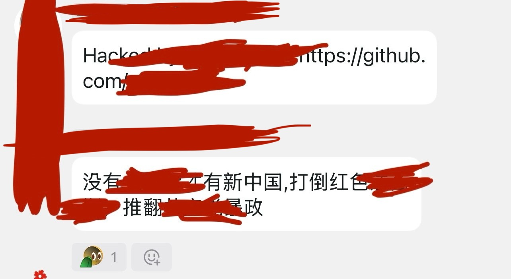

> [!caution]
>
> 截至 2025 年 9 月 6 日凌晨 1 点，涉事的**所有** QQ 号以及发表过攻击性言论的**所有** QQ 群都已经被**永久封禁**！此次事件的影响范围之广、波及人数之多、后果之严重，均为史无前例。笔者再次提醒各位读者，务必重视软件的安全配置，切勿因小失大！

2025 年 9 月 5 日晚，NapCat 群聊中多人目击到诸多搭载了 NapCat 的 QQ 账号竟然不约而同地发布了攻击中国共产党的言论，并声称攻击是由 GitHub 上的某位用户发起的。此次攻击已导致多人的 Bot 账号以及多个群聊因发布的言论而被封禁。笔者将对此事进行简单的复盘，并发表一些个人的观点。

<!--  -->

通过调取部分受影响的 Bot 的日志，攻击者主要针对开放在公网并且未设置 token 的 OneBot 服务发起攻击。此次攻击面向所有 OneBot 服务，与 NapCat 本身无关。攻击者通过向 OneBot 服务发送 `send_msg` 请求，诱导 Bot 发送攻击性言论。

OneBot 11 作为被广泛使用的 Bot 通信协议，在其[文档](https://github.com/botuniverse/onebot-11/blob/master/communication/authorization.md)中明确写出了 token 的使用方法，并且现存的各大协议端框架都支持 token 的配置。但是，为什么攻击者仍然能够得逞，并且哪怕攻击者并不是针对 NapCat 发起攻击，遭受攻击的 Bot 大多数都是搭载了 NapCat 的呢？

笔者认为，首要原因在于，OneBot 服务的 token 配置并非强制要求，且部分用户安全意识薄弱，在部署 OneBot 服务时未设置 token，导致服务暴露在公网时极易受到攻击。其次，NapCat 的易用性和知名度使得其用户群体中不乏初学者，安全意识薄弱的用户占比更高，导致受影响的 Bot 多数为 NapCat 用户。

至于 NapCat 的开发者，他们是否应该为这件事情负责呢？笔者的观点是，在一定程度上，**是的**。

诚然，NapCat 的开发者在文档和 WebUI 中都确有提及 token 的重要性，并且 NapCat 也提供了便捷的 token 配置选项。然而，开发者仍然有义务了解自己的用户群体构成，并且有针对性地为此类用户提供更为显著的安全提示，甚至在用户首次启动 OneBot 服务时强制要求设置 token，而显然 NapCat 的开发者没有意识到这一点。此外，非常重要的一点是，很大一部分用户并不是通过代码仓库或文档来了解 NapCat 的，而往往是通过各种第三方平台（如 QQ 群、Bilibili、论坛等）获取的 NapCat 安装包和使用教程，这些渠道往往缺乏对安全配置的说明和提示，导致用户在部署时忽略了安全配置。

还有一点需要关注的是 NapCat 的默认行为。经过笔者测试，在 NapCat WebUI 中配置 OneBot 服务时，默认绑定的 IP 是 `0.0.0.0`，这意味着服务在部署后会绑定到所有可用的 IP，而非仅仅是本地回环地址 `127.0.0.1`。加之用户不常检查防火墙设置和 token 配置，导致服务一旦启动便毫无防备地暴露在公网中，极易受到攻击。笔者认为，NapCat 的开发者应当重新考虑这一默认行为，或至少弹出显著的安全提示，提醒用户注意服务的监听地址。

此外，虽然和本次攻击无关，但 NapCat 的 WebUI 同样也是默认绑定 `0.0.0.0`，并且有着默认的管理员密码 `napcat`。即使[文档](https://napneko.github.io/other/security#webui-%E5%AE%89%E5%85%A8%E4%B8%8E%E4%B8%80%E4%BA%9B%E5%86%B7%E7%9F%A5%E8%AF%86)中详细阐述了 WebUI 的安全性设计，并且在用户登录 WebUI 时会强制要求修改密码，但这并不能阻止一些用户执意使用默认密码。并且，这样的“首次登录要求修改密码”的设计并非万无一失，因为一部分用户甚至在启动 NapCat 后不登录 WebUI，这样就无法触发修改密码的流程，导致 WebUI 依然使用默认密码暴露在公网中，极易受到攻击，并且笔者也目击过有人成功发起过攻击，成功登入了后台（但未造成任何实质性损害）。

（草，怎么把这篇文章写成对 NapCat 的吐槽了）

最后还是想说，软件的易用性和安全性始终是一个难以维护的天平，对于一般开发者而言，很难做到面面俱到。笔者认为，在二者相抵时，安全性应当优先于易用性，甚至可以为此不惜提高使用门槛。作为开源软件，开发者并不需要为软件的易用性负责，但安全性却是开发者不可推卸的责任，也是为了保护用户以及**自身**的安全所必须考虑的地方。毕竟，免责条款并不能真正保护开发者免受法律追责，尤其是在 QQ Bot 这种灰色地带的软件中，开发者更应当谨慎行事，小心驶得万年船。
