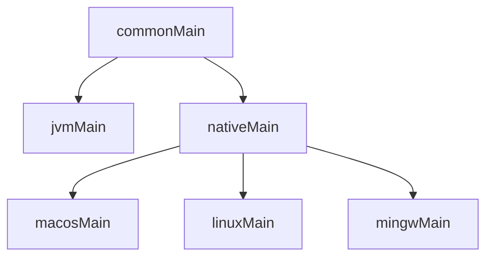

Kotlin 的 Native 支持横跨 Windows (MinGW)、Linux、macOS、Android、iOS（包含 iOS、iPadOS、tvOS 和 watchOS），而官方的文档更侧重于介绍移动端和嵌入式设备的使用，对桌面端以及 Native 独有特性的介绍相对比较分散。笔者将基于自己的开发经验，以开发桌面端（Windows、Linux、macOS）命令行应用为例，介绍 Kotlin/Native 的配置与使用。

本文假设读者已有一定的 Kotlin/JVM 开发经验，对 Gradle 构建工具的配置有基本了解。本文撰写时 Kotlin 的最新版本为 `2.3.0`，使用的 Gradle 版本为 `8.14`。

## 开发前的准备

开发 Kotlin/Native 应用，首先需要适应“缺胳膊少腿”的开发环境和自行“造轮子”的开发体验。。与 Kotlin/JVM 不同，Kotlin/Native 项目通常不能享受 JVM 的生态红利，很多常用的 JVM 库并不支持 Native 平台。Kotlin 标准库虽然支持 Native，但其功能相对有限，远不及 Java 标准库丰富。因此，开发者需要寻找并使用专门为 Kotlin/Native 设计的库，或者使用 Kotlin/Native 的 C Interop 功能进行调用。

其次，在 Kotlin/Native 中，反射几乎处于不可用状态，可用的反射 API 几乎只有 `KClass.qualifiedName` 和 `KClass.simpleName`。这意味着许多依赖反射的功能，例如灵活的序列化，将无法使用。所幸，`kotlinx-serialization` 提供了编译时生成序列化代码的功能，大多数功能都可以在 Kotlin/Native 中使用。

最后，相对于 JVM 平台，Kotlin/Native 编译之后无法直接解释执行，而是需要通过进一步的链接（link）生成可执行文件，这大大拖慢了编译速度。虽然 Kotlin/Native 提供了 Debug 和 Release 两种编译模式，但即使是 Debug 模式下，链接速度也远不及 JVM artifacts 的编译速度。因此，开发者需要对编译时间有心理准备。

> [!note]
>
> 一个参考数据：在笔者的开发机器（Apple M1, 16GB RAM）上，在已启动了 Gradle Daemon 的情况下，编译 Yogurt 的 JVM target 花费约 20s，而编译和链接 release 的 macOS arm64 target 则花费 4~5 分钟。因此，对于开发活跃、需要频繁测试的纯 Kotlin 项目，建议优先使用 JVM target 进行开发和测试，待功能稳定后再切换到 Native target 进行最终编译。

## 项目配置

我们已经知道要开发 Kotlin/JVM 项目，需要在 `build.gradle.kts` 中添加 Kotlin 插件：

```kts
plugins {
    kotlin("jvm") version "2.3.0"
}
```

而要开发 Kotlin/Native 项目，则需要添加 `kotlin("multiplatform")` 插件：

```kts
plugins {
    kotlin("multiplatform") version "2.3.0"
}
```

在开发 JVM 应用时用到的其他 Kotlin 插件，例如 `kotlin("plugin.serialization")`，在 Kotlin/Native 项目中同样适用。

Kotlin/Native 除在 macOS 上开发需要配置 Xcode 之外，无需手动安装任何额外的工具链。Gradle 的 Kotlin Multiplatform 插件会将所需工具（e.g. `konanc`, LLVM）自动下载并配置好。工具链一般安装在 `~/.konan` 目录下。

### Source Set

不同于 Kotlin/JVM 项目，Kotlin Multiplatform 项目因为涉及到平台差异，代码不一定只存在于一个根目录下，而是会根据目标平台划分到不同的目录下，这样的目录就叫做 Source Set。每个 Source Set 都可以有自己的依赖和配置。此外，不同的 Source Set 存在继承关系。例如，一个典型的桌面 KMP 项目的 Source Set 结构如下：



在上图中，`commonMain` 是所有平台的公共代码，`jvmMain` 是 JVM 平台特有的代码，`nativeMain` 是所有 Native 平台的公共代码，而 `macosMain`、`linuxMain` 和 `mingwMain` 则分别是 macOS、Linux 和 Windows (MinGW) 平台特有的代码。一般而言，我们在 `commonMain` 中编写大部分与平台无关的逻辑，而在各个平台特有的 Source Set 中编写与平台相关的代码。

### 目标平台配置

了解了 Source Set 的概念之后，我们来看一个支持桌面端平台的 Kotlin/Native 的项目配置示例：

```kts
kotlin {
    macosArm64()
    linuxX64()
    mingwX64()

    sourceSets {
        commonMain.dependencies {
            implementation("org.jetbrains.kotlinx:kotlinx-serialization-json:1.9.0")
            implementation("org.jetbrains.kotlinx:kotlinx-coroutines-core:1.10.2")
            implementation("io.ktor:ktor-client-core:3.3.3")
            implementation("io.ktor:ktor-client-content-negotiation:3.3.3")
            implementation("io.ktor:ktor-serialization-kotlinx-json:3.3.3")
        }
        mingwMain.dependencies {
            implementation("io.ktor:ktor-client-winhttp:3.3.3")
        }
        macosMain.dependencies {
            implementation("io.ktor:ktor-client-darwin:3.3.3")
        }
        linuxMain.dependencies {
            implementation("io.ktor:ktor-client-curl:3.3.3")
        }
    }

    targets.withType<KotlinNativeTarget> {
        binaries {
            executable {
                entryPoint = "com.example.main"
            }
        }
    }
}
```

在这段配置中，首先指定了三个桌面端平台：`macosArm64`、`linuxX64` 和 `mingwX64`。随后，在 `sourceSets` 块中，分别为公共代码和各个平台特有的代码添加了依赖。最后，在 `targets.withType<KotlinNativeTarget>` 块中，配置了可执行文件的入口点。

### 构建与运行

在指定平台并重新加载 Gradle 配置之后，我们就可以使用 Gradle 任务来构建和运行 Kotlin/Native 应用了。对于每个目标平台，Gradle 会自动生成相应的构建任务。例如，要构建 macOS 平台的可执行文件，可以运行以下命令：

```bash
./gradlew linkReleaseExecutableMacosArm64
```

需要注意的是，Kotlin/Native 的 link 阶段提供了两种构建类型：Debug 和 Release。前者构建速度较快，适合开发和调试；后者则进行了优化，适合发布和生产环境使用。构建好的可执行文件一般位于 `build/bin/<platform>/[debug|release]Executable/` 目录下。

## `expect` / `actual`

Kotlin/Native 支持 Kotlin 的多平台特性，其中最重要的就是 `expect` / `actual` 机制。通过这个机制，我们可以在公共代码中声明一个接口或类的“期望”实现（`expect`），然后在各个平台特有的代码中提供具体的实现（`actual`）。这样，我们就可以在公共代码中使用这些接口或类，而不需要关心它们在不同平台上的具体实现。

例如，我们要在不同平台上判断操作系统的名称。先在 `commonMain/kotlin/Platform.kt` 中声明一个 `expect` 函数：

```kotlin
expect fun getPlatformName(): String
```

这时你的 IDE 会在这个函数处报错，提示缺少 `actual` 实现。接下来，我们在各个平台特有的 Source Set 中提供具体的实现。

在 `macosMain/kotlin/Platform.macos.kt`（这是 IDEA 推荐的命名方式）中：

```kotlin
actual fun getPlatformName(): String = "macOS"
```

在 `linuxMain/kotlin/Platform.linux.kt` 中：

```kotlin
actual fun getPlatformName(): String = "Linux"
```

在 `mingwMain/kotlin/Platform.mingw.kt` 中：

```kotlin
actual fun getPlatformName(): String = "Windows"
```

Kotlin 编译器会在编译时根据目标平台选择合适的 `actual` 实现，从而确保在运行时调用正确的代码。

## C Interop 与平台 API

Kotlin/Native 的一大亮点就是对平台 API（e.g. POSIX, WinAPI, macOS Foundation）的封装，以及对 C 语言库的互操作支持（C Interop）。下面我们以加载动态库（`.dll` / `.so` / `.dylib`）并调用其中的函数为例，介绍如何使用 C Interop。

### 获得动态库 Handle

例如，我们有一个编译到三种平台的动态库 `mylib`，其中包含一个函数 `int add(int a, int b)`。通常，在 C 程序中，调用一个外部动态库的函数需要先获得一个指向该函数的指针，然后通过该指针调用函数。在 Kotlin/Native 中，我们可以使用 `kotlinx.cinterop` 和 `platform.posix`（或 `platform.windows`）包来实现类似的功能。首先，我们需要在程序中加载这一动态库。在 `commonMain/kotlin/LibraryLoader.kt` 中声明一个 `expect` 函数：

```kotlin
import kotlinx.cinterop.*

expect fun loadLibrary(): COpaquePointer
```

> [!important]
>
> C Interop 是一个实验性功能，需要在文件或相关函数上添加 `@OptIn(ExperimentalForeignApi::class)` 注解才能使用。本文中为了简洁起见，省略了这些注解。

这里的 `COpaquePointer` 是一个指向不透明 C 结构体的指针类型，表示我们无法直接访问其内部结构。接下来，我们在各个平台特有的 Source Set 中实现 `loadLibrary` 函数。

在 `macosMain/kotlin/LibraryLoader.macos.kt` 中：

```kotlin
import kotlinx.cinterop.*
import platform.posix.*

actual fun loadLibrary(): COpaquePointer {
    val handle = dlopen("./mylib.dylib", RTLD_LAZY)
    return handle ?: error("Failed to load library")
}
```

在 `linuxMain/kotlin/LibraryLoader.linux.kt` 中：

```kotlin
import kotlinx.cinterop.*
import platform.posix.*

actual fun loadLibrary(): COpaquePointer {
    val handle = dlopen("./mylib.so", RTLD_LAZY)
    return handle ?: error("Failed to load library")
}
```

在 `mingwMain/kotlin/LibraryLoader.mingw.kt` 中：

```kotlin
import kotlinx.cinterop.*
import platform.windows.*

actual fun loadLibrary(): COpaquePointer {
    val handle = LoadLibraryA("./mylib.dll")
    return handle ?: error("Failed to load library")
}
```

> [!note]
>
> 注意不同平台 API 所返回的 Pointer 等类型均为可空类型，因此需要进行空值检查。

### 获得方法指针

获得动态库的 Handle 之后，我们就可以通过该 Handle 获取函数指针了。我们同样在 `commonMain/kotlin/LibraryLoader.kt` 中声明一个 `expect` 函数：

```kotlin
expect fun getAddFunction(handle: COpaquePointer): CPointer<CFunction<(Int, Int) -> Int>>
```

注意在这时就已经可以声明函数的签名了。一个函数类型可以通过 `CFunction<...>` 来表示，其中 `...` 是函数的参数和返回值类型列表。接下来，我们在各个平台特有的 Source Set 中实现 `getAddFunction` 函数。

在 `macosMain/kotlin/LibraryLoader.macos.kt` 中：

```kotlin
import kotlinx.cinterop.*
import platform.posix.*

actual fun getAddFunction(handle: COpaquePointer): CPointer<CFunction<(Int, Int) -> Int>> {
    val symbol = dlsym(handle, "add")
    return symbol?.reinterpret() ?: error("Failed to get function pointer")
}
```

在 `linuxMain/kotlin/LibraryLoader.linux.kt` 中：

```kotlin
import kotlinx.cinterop.*
import platform.posix.*

actual fun getAddFunction(handle: COpaquePointer): CPointer<CFunction<(Int, Int) -> Int>> {
    val symbol = dlsym(handle, "add")
    return symbol?.reinterpret() ?: error("Failed to get function pointer")
}
```

在 `mingwMain/kotlin/LibraryLoader.mingw.kt` 中：

```kotlin
import kotlinx.cinterop.*
import platform.windows.*

actual fun getAddFunction(handle: COpaquePointer): CPointer<CFunction<(Int, Int) -> Int>> {
    val symbol = GetProcAddress(handle, "add")
    return symbol?.reinterpret() ?: error("Failed to get function pointer")
}
```

> [!note]
>
> 这里的 `reinterpret` 函数是一个 `inline fun` 扩展函数，用于根据上下文将一个不透明指针转换为一个我们所需的类型的指针。这里的转换并不是安全的，只是告诉编译器我们知道这个指针实际上指向的类型是什么。因此，在使用 `reinterpret` 时需要确保类型匹配，否则可能会导致运行时错误。

### 调用函数

一旦获得了函数，我们就可以调用它了。在 `commonMain/kotlin/Main.kt` 中：

```kotlin
import kotlinx.cinterop.*

fun main() {
    val handle = loadLibrary()
    val addFunction = getAddFunction(handle)

    val result = addFunction.invoke(3, 5)
    println("Result of add(3, 5): $result")
}
```

在上面的代码中，我们展示了在没有 `.h` 文件的情况下如何从头开始使用 C Interop 调用动态库中的函数。通过 `expect` / `actual` 机制，我们实现了跨平台的动态库加载和函数调用。在有 `.h` 文件的情况下，我们还可以使用 Kotlin/Native 的 C Interop 工具自动生成绑定代码，从而简化开发过程，在此不再赘述。

## 推荐项目

尽管 Kotlin/Native 生态相对较小，但仍有一些优秀的库可以使用。以下是笔者在开发桌面端 Kotlin/Native 应用时用到的一些库：

- kotlinx-serialization：Kotlin 官方的序列化库，支持多种格式（JSON、ProtoBuf、CBOR 等）。
- kotlinx-io：Kotlin 官方的 I/O 库，提供 `Source` / `Sink` 等抽象，并且支持文件 I/O 操作。
- [xmlutil](https://github.com/pdvrieze/xmlutil)：基于 `kotlinx-serialization` 的 XML 序列化库。
- [korlibs](https://github.com/korlibs/korlibs)：源自 Kotlin 游戏引擎 KorGE，几乎是一个全面的 Kotlin 标准库补充，包含文件 I/O、媒体处理等功能（尽管其文档尚未完善）。
- [mordant](https://github.com/ajalt/mordant)：一个用于构建终端应用的 Kotlin 库，提供丰富的文本样式和布局支持。
- [BuildKonfig](https://github.com/yshrsmz/BuildKonfig)：一个允许你在编译时注入配置信息到 Kotlin 代码中的 Gradle 插件，支持 Kotlin/Native 项目。

## 后记

由于本文涉及较多专业概念，可能会有部分内容不够准确或清晰。如有谬误，欢迎通过 [GitHub](https://github.com/Wesley-Young/wesley-young.github.io/issues/new?title=%E3%80%8A%E6%A1%8C%E9%9D%A2%E7%AB%AF%20KN%20%E5%BC%80%E5%8F%91%E6%8C%87%E5%8D%97%E3%80%8B%E5%8B%98%E8%AF%AF) 或作者社交媒体账号反馈。

本文仅涉及了 Kotlin/Native 开发的冰山一角，关于更多内容可以参阅 Kotlin 的官方文档：

- [Kotlin/Native](https://kotlinlang.org/docs/native-overview.html)
- [Platform libraries](https://kotlinlang.org/docs/native-platform-libs.html)
- [Interoperability with C](https://kotlinlang.org/docs/native-c-interop.html)

以下是笔者使用 Kotlin Multiplatform 开发的项目，欢迎参考：

- [Acidify](https://github.com/LagrangeDev/acidify)
