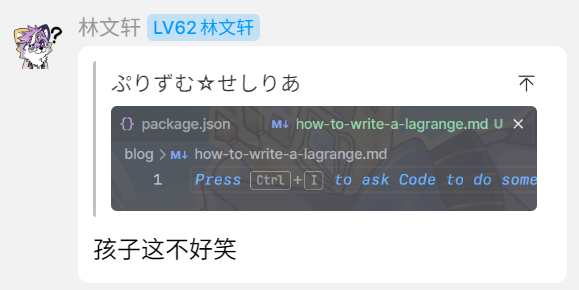

<div align="center">

*“孩子们，这不好笑” ——林文轩*
</div>

如何从头开始写一个 QQ Bot 协议端实现？

作为一个货真价实的“吃百家饭”的协议端开发者，我参与过 NapCatQQ 和 Lagrange.Core 的开发，并且自己也维护两个类似 Lagrange 的协议实现，分别是 [tanebi](https://github.com/SaltifyDev/tanebi) (TypeScript) 和 [saltify-adapter-lagrange](https://github.com/SaltifyDev/saltify/tree/main/saltify-adapter-lagrange) (Kotlin)。下面，我将从我的实践出发，介绍一个 QQ Bot 协议端需要包含哪些部分，以及一些关键的细节。

## 概念

相信这篇文章的读者对协议端和应用端的概念并不陌生，但为了保险起见，还是进行简要介绍：

现代 QQ Bot 框架分两大类，一类是**协议端**，负责与 QQ 服务器通信，实现收发消息、接收通知等基础功能；另一类是**应用端**，负责解析用户调用并给出回应，实现较为高层次的功能。这两者之间通过网络进行通信，最为常用的通信协议是 [OneBot 11](https://11.onebot.dev/)。老实说，虽然 Lagrange 的开发者看不上这个协议，并且设计了 [Milky](https://milky.ntqqrev.org) 来取代 OneBot 11，但不得不承认，OneBot 11 仍然会在一段时间内占据主要地位。

说到协议端，又可以细分为两种：
- **纯协议实现**：直接构造 Socket 与 QQ 服务器通信，构造和发送诸多数据包，模拟一个正常 QQ 客户端的行为。代表项目是 Lagrange.Core，以及之前的 mirai、go-cqhttp 等。
- **Hook 实现**：这是一种新兴的协议端实现思路。我们知道 PC NTQQ 使用了 Electron，包含前端和后端，并且有完整的 Node.js 环境；而 Hook 协议端将 JS 代码注入 QQ，调用本来应当由 QQ 前端调用的后端接口，由此实现各种功能。代表项目是 NapCatQQ、LLOneBot。
  > [!tip]
  >
  > 通过注入 JS 代码并不能实现所有的 QQ 功能，为了实现 PC 端 NTQQ 不支持的功能，还需要通过内存注入的方式直接收发数据包，因此这些实现也包含了纯协议实现的成分。

我们接下来会重点介绍纯协议实现的开发。

## 项目架构

以下的内容假设你要编写一个类似 Lagrange.Core 的库，而不是实现了 OneBot 11 之类的通信协议的完整应用程序。

Lagrange.Core 区分了**外层**和**内层**（Internal）。从概念上讲，内层负责的有：
- 定义与 QQ 进行数据交换所用的各种数据包的结构
- 定义各种可能的“行为”（例如发送消息、设置群名称）和相应的参数、返回值
- 用给出的参数组装出实际的数据包，并将返回的数据包解开成返回值
- 初步解析服务器推送的数据包
- 实现加解密功能，与 QQ 服务器直接通信

外层负责的有：
- 处理用户的行为请求，调用内层的行为
- 实现消息的编码和解码
- 进一步解析服务器推送的数据包，提供更高层次的事件

我们以 Lagrange V2 的文件夹结构为例：

import { FileTree } from 'nextra/components';

<FileTree style={{ width: '100%' }}>
  <FileTree.Folder name="Lagrange.Core">
    <FileTree.Folder name="Common" />
    <FileTree.Folder name="Events" />
    <FileTree.Folder name="Exceptions" />
    <FileTree.Folder name="Message" />
    <FileTree.Folder name="Utility" />
    <FileTree.Folder name="Internal">
      <FileTree.Folder name="Context" />
      <FileTree.Folder name="Events" />
      <FileTree.Folder name="Logic" />
      <FileTree.Folder name="Network" />
      <FileTree.Folder name="Packets" />
      <FileTree.Folder name="Services" />
    </FileTree.Folder>
  </FileTree.Folder>
</FileTree>

## 基础设施

### 签名服务

NTQQ 协议要求所有数据包进行签名，这无疑增加了协议端的开发难度。目前**没有**公开的签名服务实现，并且已知的实现方式都是基于入侵式的 Hook 或者内存注入，而非算法实现。Lagrange.Core 也没有实现签名，而是通过 HTTP API 调用公开的签名服务来对数据包进行签名。

### 加密算法

Lagrange.Core 中用到的加密算法如下：
- 各种数据包都使用一种 **TEA**（[微型加密算法](https://zh.wikipedia.org/wiki/%E5%BE%AE%E5%9E%8B%E5%8A%A0%E5%AF%86%E7%AE%97%E6%B3%95)）的变体（原版进行 32 轮迭代，QQ 只进行 16 轮）进行加密；
- 登录数据包使用了 **ECDH**（[椭圆曲线 Diffie–Hellman 密钥交换](https://zh.wikipedia.org/wiki/%E6%A9%A2%E5%9C%93%E6%9B%B2%E7%B7%9A%E8%BF%AA%E8%8F%B2-%E8%B5%AB%E7%88%BE%E6%9B%BC%E9%87%91%E9%91%B0%E4%BA%A4%E6%8F%9B)）的两种曲线 `prime256v1` 和 `secp192k1` 进行加密；
- 此外在一部分地方还使用了 **AES**（[高级加密标准](https://zh.wikipedia.org/zh-cn/%E9%AB%98%E7%BA%A7%E5%8A%A0%E5%AF%86%E6%A0%87%E5%87%86)） 加密。

> [!warning]
>
> 请保证你所用的语言支持上述算法（除 TEA 变体之外，TEA 的变体需要自行编写），或者你有信心自己编写一套 ECDH/AES 算法。可以从 Lagrange.Core 的仓库中找到这些算法的具体实现。

### TLV

QQ 的数据包中使用了一种他们称作 TLV 的格式，尽管这个格式和传统的 [Type-Length-Value 格式](https://en.wikipedia.org/wiki/Type%E2%80%93Length%E2%80%93Value)有很大不同。QQ 所用的 TLV 格式的编码内容主要分以下三种：
- **定长标量**：例如 `int32`、`int64` 等，直接将数据编码为对应的二进制格式。在编码多于一个字节的整数时，QQ 采用了**大端字节序（Big Endian）**，即高位在前，低位在后。
- **定长字节数组**：例如 `byte[16]`，直接将 16 字节的数组编码为对应的二进制格式。
- **变长字节数组**：例如 `byte[]`，先将长度编码为某种定长标量，然后再编码内容。长度可编成的定长标量通常有 `int8`、`int16`、`int32`。
  > [!important]
  >
  > 长度的编码有两种模式：
  > - 编码的长度等于实际长度；
  > - 编码的长度等于实际长度加上用于编码长度的字节数，我们暂时称之为 `LengthIncludePrefix`。
  >
  > 在 `LengthIncludePrefix` 的模式下，例如 `int8` 的长度编码为 1 字节，实际内容长度为 3 字节，则总长度为 4 字节。

例如，假设我们有这样的一个 Schema（用伪代码描述）：

```
int32 a;
int64 b;
byte[16] c;
byte[] d Prefix int8;
byte[] e Prefix int16 LengthIncludePrefix;
```

编码如下的数据：

```
a = 1;
b = 2;
c = {0x01, 0x02, 0x03, 0x04, 0x05, 0x06, 0x07, 0x08,
     0x09, 0x0A, 0x0B, 0x0C, 0x0D, 0x0E, 0x0F, 0x10};
d = {0x11, 0x12, 0x13};
e = {0x14, 0x15, 0x16};
```

那么最终的二进制数据包将是：

```
00 00 00 01             // 1 in int32
00 00 00 00 00 00 00 02 // 2 in int64
01 02 03 04 05 06 07 08 09 0A 0B 0C 0D 0E 0F 10
03 11 12 13             // Length = 3 (byte[])
00 05 14 15 16          // Length = 3 (byte[]) + 2 (int16) = 5
```

### Tagged TLV

Tagged TLV 是 TLV 的一种变体，它实际上对应一个特殊的 Schema：

```
int16 tag;
byte[] value Prefix int16;
```

这种结构常见于与登录有关的数据包中。`tag` 的值是一个整数，表示该数据包的“类型”标记；`value` 则是一个变长字节数组，包含了该数据包的具体内容。一个登录数据包通常包含多个 Tagged TLV，在编码时，先用一个 `int16` 来表示总共的 Tagged TLV 的数量，然后按照上面的 Schema 依次编码每个 Tagged TLV。

### ProtoBuf

QQ 的数据包大量使用了 [ProtoBuf](https://protobuf.dev/) 作为编码格式。因此，我们需要一个用于编解码 ProtoBuf 的基础设施，将序列化的 ProtoBuf 二进制信息与程序中的结构体相对应。传统的做法一般是使用 `protoc` 将 `.proto` 文件编译到各种语言的序列化代码；但出于某种奇怪的传统和对效率的极致追求，Lagrange 的实现者采用了另一种思路，直接通过属性标记将 ProtoBuf 高效集成到强类型对象结构的声明中。

Lagrange V1 使用的是 [protobuf-net](https://github.com/protobuf-net/protobuf-net)；V2 则使用了自主编写的、兼容 Native AOT 的序列化框架 [Lagrange.Proto](https://github.com/LagrangeDev/LagrangeV2/tree/main/Lagrange.Proto)。笔者也分别用 [TypeScript](https://github.com/SaltifyDev/tanebi-protobuf) 和 [Kotlin]((https://github.com/SaltifyDev/saltify-protobuf)) 实现了两个类似的框架。

## Uin 和 Uid

Uin 就是 QQ 号，是旧版 QQ 协议用于标识用户的方式。随着 NTQQ 协议的引入，Uin 逐渐被 Uid 取代。Uid 是一个全局唯一的标识符，通常是一个字符串，用于在 NT 协议中标识用户。从设计上来看，Uid 是一个更为灵活的标识符，能够防止恶意用户通过猜测 Uin 来进行攻击。Uid 向 Uin 的转换是容易的，但反过来就不行了。

## 消息处理

QQ 的消息处理是一个复杂的过程。接收消息的过程大致可以分为三部分：
- **解析消息**：将接收到的消息数据包解析为一个消息对象，包含发送者、接收者、消息内容等信息。
- **解析消息段**：将消息中包含的文本、图片、视频等消息内容解析为具体的消息段。每个消息段都有一个类型标识符，表示该段的内容类型（例如文本、图片、视频等）。
- **处理消息段**：根据消息段的类型，调用相应的处理函数进行处理。例如，对于文本消息段，直接将文本内容传递到应用层；对于图片、视频等媒体消息段，则需要通过包含的 File ID 获取实际的下载 URL（这一 URL 通常是临时的）。

同样，发送消息的过程也分为三部分：
- **预处理消息段**：将应用层传入的消息段进行预处理，例如，将图片、视频等媒体消息段上传到服务器，并获取相应的 File ID。
- **组装消息段**：将预处理后的消息段组装为一个完整的消息段列表。每个消息段都包含了类型标识符、内容等信息。
- **组装消息**：将所有消息段组装为一个完整的消息对象。这个消息对象包含了发送者、接收者、消息段等信息。

### 消息标识符

在 QQ 中，定位一条消息通常需要三个因素：
- **消息场景**：私聊或群聊；
- **Peer 标识符**：
  - 在私聊中，Peer 标识符是对方的 Uin；
  - 在群聊中，Peer 标识符是群号；
- **消息序列号**：QQ 服务器为每个 Peer 维护一个递增的消息序列号，表示消息在该 Peer 中的顺序。

在执行与消息有关的操作时，确定了消息场景的情况下，通常需要提供 Peer 标识符和消息序列号。在回复和撤回私聊消息时，还需要提供 `clientSequence`、`random`、`messageUid` 等参数，这些参数目前作用未知，但可以通过提供 Peer 标识符和消息序列号来获取。

### Highway

QQ 的媒体文件上传与一般数据包使用不同的信道，这个信道被称为 Highway。使用 Highway 上传文件，需要先将媒体文件的元信息和哈希上报到 QQ 服务器，获得一个文件 ID 和上传地址（如果服务器已存在哈希值相同的文件，则会告知客户端无需上传），随后协议端可以向返回的地址上传文件。上传完成后，协议端即可将文件 ID 和其他元信息编码进消息段，完成最终的消息发送。

### 元信息处理

上传图片时需要提供图片的**格式**和**尺寸**，这需要协议端进行解析。上传视频时，同样需要解析视频的**格式**、**时长**、**尺寸**，并且提供一张**缩略图**。

上传语音时，需要将各种形式的语音转换为 [SILK 格式](https://zh.wikipedia.org/wiki/SILK)再上传，这是一种针对人类语音的压缩格式。社区为此已经开发了多种工具，其中的一部分列举如下：
- [silk-codec](https://github.com/KasukuSakura/silk-codec)
- [NTSilk](https://ntsilk.ilharper.com/)
- [LagrangeCodec](https://github.com/LagrangeDev/LagrangeCodec)

哈希算法方面，QQ 在处理文件数据时使用了 [MD5](https://zh.wikipedia.org/wiki/MD5) 和 [SHA-1](https://zh.wikipedia.org/wiki/SHA-1) 两种哈希算法，即使这两种算法都已经被认为不够安全。此外，在**私聊文件**场景下，还使用了一种独特的 TriSHA1 算法，在文件体积超过 30MB 时，采样文件的头、中、尾各 10MB 进行 SHA-1 哈希计算，可以参考 [LagrangeV2 中的实现](https://github.com/LagrangeDev/LagrangeV2/blob/main/Lagrange.Core/Utility/Cryptography/TriSha1Provider.cs)。

## 后记

本文内容基于 QQ Bot 社区多年的研究成果，在这里向所有致力于编写协议端的开发者致以由衷的感谢。撰写过程中参考了大量已有的代码，所引用之处已在正文中以超链接的形式注明。

由于本文涉及较多专业概念，可能会有部分内容不够准确或清晰。如有谬误，欢迎通过 [GitHub](https://github.com/Wesley-Young/wesley-young.github.io/issues/new?title=%E3%80%8A%E5%A6%82%E4%BD%95%E5%86%99%E4%B8%80%E4%B8%AA%20Lagrange%E3%80%8B%E5%8B%98%E8%AF%AF) 或作者社交媒体账号反馈。
